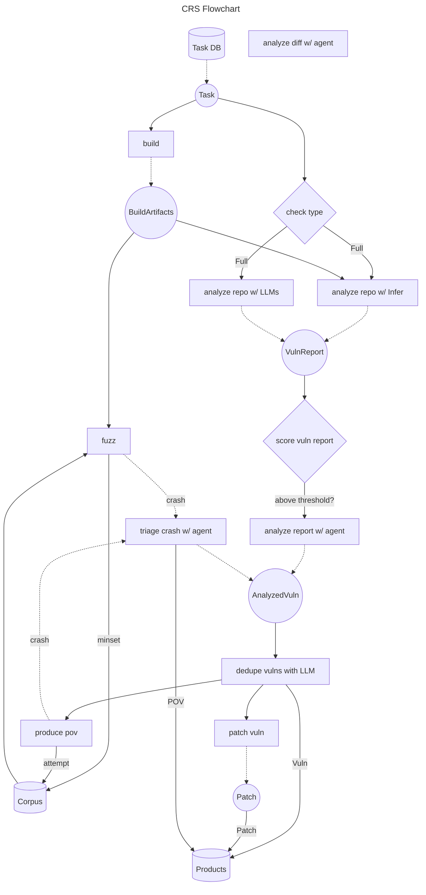

# CRS Architecture

```mermaid
---
title: CRS Flowchart
---
graph TD
    %% DBs
    TaskDB[(Task DB)]
    Corpus[(Corpus)]
    Products[(Products)]

    %% Data types
    Task((Task))
    Artifacts((BuildArtifacts))
    VulnReport((VulnReport))
    AnalyzedVuln((AnalyzedVuln))
    Patch((Patch))


    %% Processes
    Build[build]
    Fuzz[fuzz]
    Type{check type}
    Infer[analyze repo w/ Infer]
    AInalyze[analyze repo w/ LLMs]
    Diff[analyze diff w/ agent]
    Score{score vuln report}
    VulnAnalyze[analyze report w/ agent]
    POVProduce[produce pov]
    GenPatch[patch vuln]
    LLMTriage[triage crash w/ agent]

    DedupeVuln[dedupe vulns with LLM]

    %% Edges
    TaskDB -.-> Task
    Task --> Build -.-> Artifacts

    Fuzz -- minset --> Corpus
    Fuzz -. crash .-> LLMTriage

    Task --> Type -- Full --> Infer -.-> VulnReport
             Type -- Full --> AInalyze -.-> VulnReport

    Artifacts --> Fuzz
    Artifacts --> Infer

    VulnReport --> Score -- above threshold? --> VulnAnalyze -.-> AnalyzedVuln

    AnalyzedVuln --> DedupeVuln

    DedupeVuln --> POVProduce -- attempt --> Corpus
                   POVProduce -. crash .-> LLMTriage
    DedupeVuln -- Vuln --> Products
    DedupeVuln --> GenPatch -.-> Patch

    LLMTriage -.-> AnalyzedVuln


    Corpus --> Fuzz

    Patch -- Patch --> Products
    LLMTriage -- POV --> Products
```
