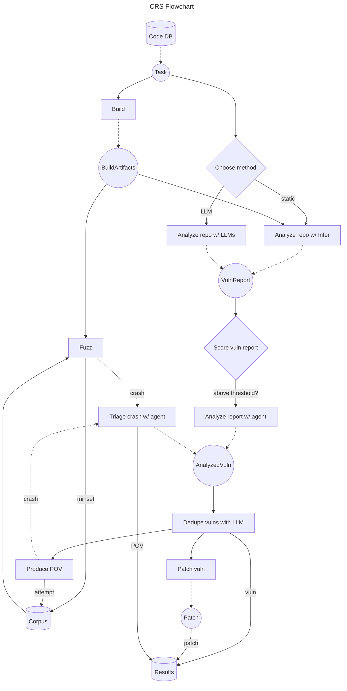

# CRS Architecture

```mermaid
---
title: CRS Flowchart
---
graph TD
    %% DBs
    TaskDB[(Code DB)]
    Corpus[(Corpus)]
    Products[(Results)]

    %% Data types
    Task((Task))
    Artifacts((BuildArtifacts))
    VulnReport((VulnReport))
    AnalyzedVuln((AnalyzedVuln))
    Patch((Patch))


    %% Processes
    Build[Build]
    Fuzz[Fuzz]
    Type{Choose method}
    Infer[Analyze repo w/ Infer]
    AInalyze[Analyze repo w/ LLMs]
    Score{Score vuln report}
    VulnAnalyze[Analyze report w/ agent]
    POVProduce[Produce POV]
    GenPatch[Patch vuln]
    LLMTriage[Triage crash w/ agent]

    DedupeVuln[Dedupe vulns with LLM]

    %% Edges
    TaskDB -.-> Task
    Task --> Build -.-> Artifacts

    Fuzz -- minset --> Corpus
    Fuzz -. crash .-> LLMTriage

    Task --> Type -- static --> Infer -.-> VulnReport
             Type -- LLM --> AInalyze -.-> VulnReport

    Artifacts --> Fuzz
    Artifacts --> Infer

    VulnReport --> Score -- above threshold? --> VulnAnalyze -.-> AnalyzedVuln

    AnalyzedVuln --> DedupeVuln

    DedupeVuln --> POVProduce -- attempt --> Corpus
                   POVProduce -. crash .-> LLMTriage
    DedupeVuln -- vuln --> Products
    DedupeVuln --> GenPatch -.-> Patch

    LLMTriage -.-> AnalyzedVuln


    Corpus --> Fuzz

    Patch -- patch --> Products
    LLMTriage -- POV --> Products
```
